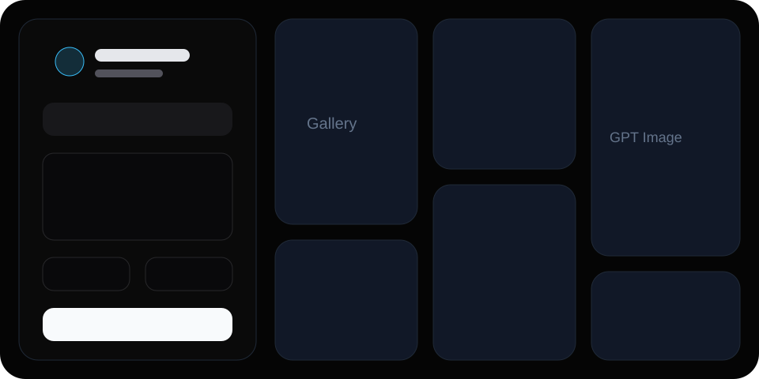

# GPT Image Console for sub2api on Cloudflare Pages

[](https://dash.cloudflare.com/?to=/:account/pages/new)
[](./LICENSE)
[](https://react.dev/)
[](https://developers.cloudflare.com/pages/)

面向生产部署的 GPT Image Web Console，基于 React、Vite、TypeScript 和 Cloudflare Pages Functions 构建。项目通过 Cloudflare Pages Functions 将前端请求安全代理到 sub2api 或其他 OpenAI-compatible Images API 服务，支持文本生成、图片编辑、参数化配置和 Gallery 结果管理。

该项目适合作为个人图像生成工作台、团队内部图片实验平台，或部署在 Cloudflare 全球边缘网络上的轻量级 AI 图片应用模板。



## 核心能力

- 专业化暗色控制台界面，包含参数面板、生成队列和瀑布流 Gallery。
- 支持文本生成与图片编辑两种工作流，自动选择 Images API 生成或编辑端点。
- 支持模型、尺寸、质量、数量、输出格式、透明背景、压缩质量等常用图像参数。
- 通过 Cloudflare Pages Functions 代理上游请求，生产环境可避免向浏览器暴露 API Key。
- 支持本地调试时启用客户端配置，方便快速接入不同 sub2api 服务。
- 支持结果下载、复制 URL/Data URL，并将最新生成结果自动插入 Gallery 顶部。

## 技术栈

- React + Vite + TypeScript
- Tailwind CSS
- Cloudflare Pages Functions
- sub2api / OpenAI-compatible Images API

## 架构

```txt
Browser UI
  -> Cloudflare Pages static assets
  -> /api/config
  -> /api/image
  -> sub2api / OpenAI-compatible Images API
```

前端负责参数配置、文件上传、交互状态和结果展示；`functions/api/image.ts` 负责服务端参数整理、鉴权配置和上游 API 调用。

## 快速开始

```bash
npm install
npm run dev
```

前端开发服务器默认是 Vite。若要本地模拟 Cloudflare Pages Functions：

```bash
cp .env.example .dev.vars
npm run pages:dev
```

`.dev.vars` 示例：

```env
SUB2API_BASE_URL=https://your-sub2api.example.com/v1
SUB2API_API_KEY=sk-your-key
SUB2API_MODEL=gpt-image-2
ALLOW_CLIENT_CONFIG=true
```

## Deploy to Cloudflare Pages

[](https://dash.cloudflare.com/?to=/:account/pages/new)

推荐使用 Cloudflare Pages 部署。本项目的 `functions/api/*.ts` 会自动作为 Pages Functions 运行，前端静态资源由 Cloudflare Pages 托管。

1. 点击上方按钮打开 Cloudflare Pages 创建入口。
2. 选择 `Connect to Git`，授权并选择本仓库。
3. Framework preset 选择 `React (Vite)`，或手动填写以下配置：

```txt
Build command: npm run build
Build output directory: dist
Root directory: /
```

4. 在 Environment variables 中添加：

```txt
SUB2API_BASE_URL=https://your-sub2api.example.com/v1
SUB2API_API_KEY=sk-your-key
SUB2API_MODEL=gpt-image-2
ALLOW_CLIENT_CONFIG=false
```

5. 点击 `Save and Deploy` 完成部署。

> Cloudflare 官方 Deploy button 目前主要用于 Workers 应用。Pages 项目建议通过 Pages 的 Git 集成完成一键创建和持续部署。

## 推送到 GitHub

已有空仓库时：

```bash
chmod +x scripts/push-github.sh
./scripts/push-github.sh your-github-name/gpt-image-gallery
```

还没有仓库，但本机装了 GitHub CLI 时：

```bash
chmod +x scripts/create-and-push-github.sh
./scripts/create-and-push-github.sh your-github-name/gpt-image-gallery private
```

`private` 可以改成 `public`。

## API 路由

### `GET /api/config`

返回服务端配置状态，不返回密钥。

### `POST /api/image`

前端以 `FormData` 调用。服务端会根据是否上传了 `image` 自动选择：

- 纯文本生成：`/v1/images/generations`
- 上传图片编辑：`/v1/images/edits`

常用字段：

```txt
prompt
mode=generate|edit
model=gpt-image-2
size=1024x1024|1024x1536|1536x1024|auto
quality=auto|low|medium|high
n=1|2|4|8
output_format=png|jpeg|webp
background=auto|opaque|transparent
output_compression=0..100
```

## 生产建议

- 生产环境建议设置 `ALLOW_CLIENT_CONFIG=false`，避免用户在浏览器端传入自定义上游配置。
- `SUB2API_API_KEY` 应仅配置在 Cloudflare Pages 环境变量中，不要提交到 GitHub。
- 如果 sub2api 返回 `model_not_found`，请在 sub2api 后台将 `gpt-image-2` 映射到上游实际可用的图片模型。
- 大尺寸图片或一次生成多张图片可能触发 Cloudflare 或上游服务的请求/响应限制，建议先使用 `n=1` 验证。
- 建议为生产项目配置自定义域名、访问控制和日志监控。


## 可选：GitHub Actions 自动部署

仓库里已经包含 `.github/workflows/cloudflare-pages.yml`。如果你不想使用 Cloudflare Dashboard 的 Git 集成，也可以在 GitHub 仓库 Secrets 里添加：

```txt
CLOUDFLARE_API_TOKEN
CLOUDFLARE_ACCOUNT_ID
CLOUDFLARE_PAGES_PROJECT_NAME
```

之后 push 到 `main` 或手动运行 workflow 即可部署。

## 手动部署命令

```bash
npm install
npm run build
npx wrangler pages deploy dist
```

## 目录结构

```txt
gpt-image-sub2api-cloudflare/
  functions/
    api/
      config.ts
      image.ts
  src/
    App.tsx
    index.css
    main.tsx
  public/
    _headers
  scripts/
    push-github.sh
    create-and-push-github.sh
  wrangler.toml
  package.json
```

## License

MIT
